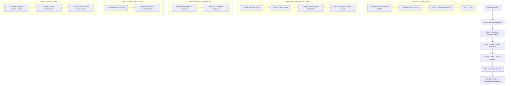

# Azure VMware Solution (AVS) Arc Deployment

This document outlines the Azure Arc deployment process for Azure VMware Solution (AVS) using the `arc-deploy.ps1` script provided in this repository.

## Overview

The `arc-deploy.ps1` script automates the deployment of Azure Arc for VMware environments. It connects your VMware vCenter to Azure Arc, enabling Azure management and monitoring capabilities for your on-premises VMware infrastructure or Azure VMware Solution (AVS) private cloud.

The deployment also includes the option to set up vSphere permissions using the `azure-arc-resourcebridge-role.ps1` script, which creates the necessary role and permissions for Azure Arc to manage vSphere resources.

## Deployment Workflow



## Deployment Details

From your recent deployment, the following configuration was applied:

### vCenter Details
- **vCenter FQDN/IP**: 10.3.1.2
- **vCenter Username**: administrator@avs.lab

### VMware Infrastructure Details
- **Datacenter**: /OnPrem-SDDC-Datacenter-3-1
- **Resource Pool**: OnPrem-SDDC-Cluster-3-1/Resources
- **Datastore**: LabDatastore
- **VM Folder**: /OnPrem-SDDC-Datacenter-3-1/vm
- **Network**: OnPrem-management-3-1

### Network Configuration
- **IP Address Prefix**: 10.3.1.0/24
- **Gateway**: 10.3.1.1
- **DNS Server**: 1.1.1.1
- **VM IP Range Start**: 10.3.1.15
- **VM IP Range End**: 10.3.1.16
- **Control Plane IP**: 10.3.1.17

## Requirements

- Windows workstation with PowerShell
- Administrator access
- Network connectivity to the vCenter
- Outbound internet connectivity for the Arc resource bridge VM

## Troubleshooting

If you encounter issues during deployment:
- Check the log file: `arcvmware-output.log` in the scripts directory
- Look for errors in the `kva.log` file (location varies by OS)
- Ensure all network requirements are met: https://aka.ms/arb-urls
- Verify that the Arc resource bridge VM has outbound connectivity

For additional assistance, contact arc-vmware-feedback@microsoft.com or create an Azure support ticket.

## Post-Deployment

After successful deployment, you can view your vCenter resource in the Azure portal:
```
https://portal.azure.com/#resource/subscriptions/[subscription-id]/resourceGroups/[resource-group]/providers/Microsoft.ConnectedVMwarevCenter/vcenters/[vcenter-name]/overview
```

Replace the placeholders with your actual deployment values.