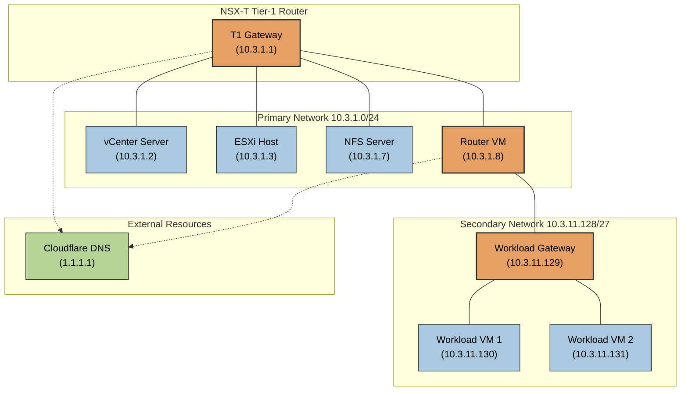

# AVS Nested Labs Network Configuration

## IP Addressing Scheme

The network addressing scheme in the AVS nested labs follows a specific pattern based on the group number and lab number parameters. The IP addressing is dynamically constructed using the group and lab numbers passed to the script.

### Network Pattern

For an example with **GroupNumber=3** and **lab=1**:

- The first octet is always **10**
- The second octet is the **group number** (3)
- The third octet is the **lab number** (1)
- The fourth octet varies depending on the specific resource

### Primary Network (10.3.1.0/24)

This creates a unique `10.3.1.0/24` subnet for each nested lab with the following assignments:

| Device | IP Address | Configuration Variable |
|--------|------------|------------------------|
| Gateway | 10.3.1.1 | `$VMGateway = "10.${groupNumber}.${labNumber}.1"` |
| VCSA | 10.3.1.2 | `$VCSAIPAddress = "10.${groupNumber}.${LabNumber}.2"` |
| ESXi Host | 10.3.1.3 | `"esxi-${groupNumber}-${labNumber}" = "10.${groupNumber}.${labNumber}.3"` |
| NFS Server | 10.3.1.7 | `$NFSVMIPAddress = "10.${groupNumber}.${labNumber}.7"` |
| Router VM | 10.3.1.8 | `$RouterVMIPAddress = "10.${groupNumber}.${labNumber}.8"` |

### Secondary Network for Workloads (10.3.11.128/27)

Additionally, for workload VMs, a secondary network is created:

- Network: `10.3.11.128/27` aka `255.255.255.224` (note how the third octet becomes `"1${labNumber}"` = `"11"`)
- Gateway: `10.3.11.129`
- Workload VMs: `10.3.11.130`, `10.3.11.131`, etc.

This design ensures that each lab environment has its own isolated network, with the group and lab number parameters serving as unique identifiers for the IP addressing scheme.

## DNS Configuration

In the lab setup, the DNS IP address is set to **1.1.1.1**, which is Cloudflare's public DNS service. This is configured in the `labdeploy.ps1` script:

```powershell
$VMDNS = "1.1.1.1"
```

This DNS IP address (1.1.1.1) is used for all VMs in the nested lab environment, including:
- The ESXi hosts
- The vCenter Server Appliance (VCSA)
- The NFS server
- The router VM
- The workload VMs

It's also visible in the `router-userdata.yaml` file where network configuration is set. Using a public DNS provider like Cloudflare simplifies the lab setup, as it doesn't require deploying and managing a separate DNS server within the nested lab environment.

## Network Diagram



The diagram above illustrates the network topology of a lab deployment for Group 3, Lab 1. It shows how the primary and secondary networks are connected through the router VM, and how DNS connectivity is provided to all components.